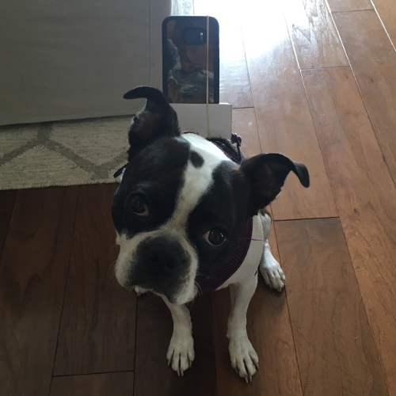

# PuppyProposer
How to propose marriage with a puppy, a phone, and a Web Socket.

1. Teach your pup to go to your partner on command.
2. Give your laptop a static IP. On OS X go to the TCP/IP tab in advanced network settings, choose DHCP with manual address, and pick an IP. This address should match the one in `server.py`.
3. Get your phone on the same wifi network as your laptop.
4. Run the Flask app: `python server.py`.
5. Navigate to `prop.html` on your phone. Chrome worked well for me.
6. Choose your voice in the dropdown menu. My puppy is a girl, so I chose a female voice.
7. Attach the phone to your puppy, making sure she's comfortable and the phone is secure.
8. Tell your puppy to go to your partner then sit in front of your laptop. Stay in a nearby room so you can hear their conversation.
9. Type a sentence into `text_goes_here.txt`. It will be sent down the Web Socket to the browser on your phone, which will speak it out loud.
10. Listen for your partner's reaction. Encourage your partner to talk to your puppy. Have a conversation that flows toward the topic of engagement.
11. Leave your laptop, find your partner, and propose.
12. Give your puppy a treat. She deserves it :-)

